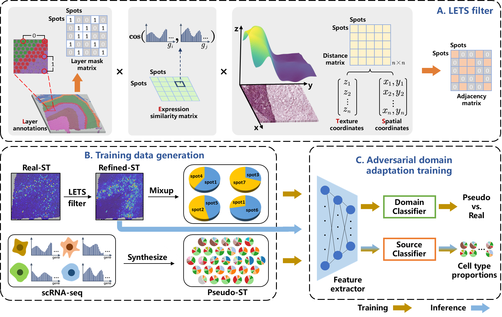

# LETSmix
 

This repository provides the official open-source code and public datasets of the paper entitled "LETSmix: a spatially informed and learning-based domain adaptation method for cell-type deconvolution in spatial transcriptomics." (https://www.biorxiv.org/content/10.1101/2024.04.27.591425v2)

Spatial transcriptomics (ST) has revolutionized our understanding of gene expression patterns by incorporating spatial context. However, many ST technologies operate on heterogeneous cell mixtures due to limited spatial resolution. To resolve cell type composition at each sequencing spot, several deconvolution methods have been proposed. Yet, these approaches often underutilize spatial context inherent in ST data and paired histopathological images, meanwhile overlooking domain variances between ST and reference single-cell RNA sequencing (scRNA-seq) data. Here, we present LETSmix, a novel deconvolution method that enhances spatial correlations within ST data using a tailored LETS filter, and employs a mixup-augmented domain adaptation strategy to address domain shifts. The performance of LETSmix was validated across diverse ST platforms and tissue types, including 10x Visium human dorsolateral prefrontal cortex, ST human pancreatic ductal adenocarcinoma, 10x Visium mouse liver, and Stereo-seq mouse olfactory bulb datasets. Our findings demonstrate that the proposed method accurately estimates cell type proportions and effectively maps them to the expected regions, establishing a new record among current state-of-the-art models. LETSmix is expected to serve as a robust tool for advancing studies on cellular composition and spatial architecture in spatial transcriptomics. 

# Datasets

All datasets used in the LETSmix paper can be downloaded from the following website: [https://zenodo.org/records/10687718](https://zenodo.org/records/11114959). These datasets have been curated and can be directly utilized with codes in this repository. For raw datasets, please refer to the "Data Availability" section in the LETSmix paper.

# Usage

Here we provide codes for the implementation of LETSmix on the PDAC-A dataset as an example. Descriptions for code files are as follows:

- main.py: This file contains codes for training the LETSmix model. Users may change the hyperparametes in the class named "Args", located at the beginning of the codes. Importantly, the hyperparameter "datadir" should be adjusted to the file path of datasets after downloading the PDAC dataset from the provided link.
- data.py: This file contains codes for preprocessing the downloaded datasets, including produres of the top marker gene selection, pseudo-spots generation, construction of the LETS filter, and the dataloader preparation.
- model.py: This file contains codes for constructing and training the LETSmix network.

After adjusting hyperparameters in the main.py, simplely run this file to train the LETSmix model. Results will be saved at the user-defined hyperparameter "logdir".

# Packages version
torch (gpu verion): 1.12.0

matplotlib: 3.4.3

numpy: 1.22.0

scanpy: 1.9.1

pandas: 1.4.0

scipy: 1.10.1

anndata: 0.8.0

scikit-learn (sklearn): 1.0.1

Pillow (PIL): 8.4.0

scikit-image (skimage): 0.21.0
