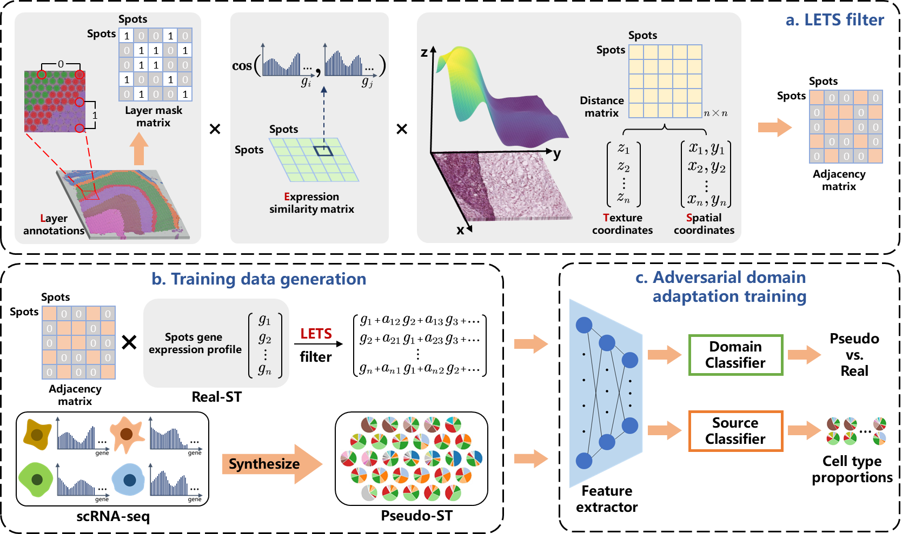

Note: This repository is not completely finished yet. Further updates are coming soon.

# LETSmix
 

This repository provides the official open-source code and public datasets of the paper entitled "a spatially informed and learning-based domain adaptation method for cell-type deconvolution in spatial transcriptomics."
LETSmix: a spatially informed and learning-based domain adaptation method for cell-type deconvolution in spatial transcriptomics
Spatial transcriptomics (ST) have revolutionized our understanding of gene expression patterns by providing spatial context. However, numerous ST technologies operate on potentially heterogeneous cells mixtures due to the limitation of spatial resolution. Current computational methods designed for cell-type deconvolution often underutilize spatial context information present in ST and the paired high-resolution histopathological images, meanwhile neglect domain variances between ST and the reference single-cell RNA sequencing (scRNA-seq) data. To address these issues, we introduce LETSmix, a novel deep learning-based domain adaptation method trained on labelled pseudo-spots generated from scRNA-seq data, and unlabelled real-spots that are refined by a designed LETS filter leveraging information from spatial correlations among sequenced spots and histological images. The performance of LETSmix is demonstrated across three publicly available ST datasets through comprehensive qualitative and quantitative assessments, setting a new record among current state-of-the-art deconvolution models. Our findings indicate that LETSmix accurately estimates the proportions of various cell types, effectively mapping them to their expected areas within the ST samples. Additionally, the utilization of domain adaptation techniques enables LETSmix to achieve highly stable results when trained with different reference scRNA-seq datasets. Applications of LETSmix to diverse tissues, including the human dorsolateral prefrontal cortex, human pancreatic ductal adenocarcinoma, and mouse liver, showcase its robust performance and generalizability across different biological contexts. 

# Datasets

All datasets used in the LETSmix paper can be downloaded from the following website: https://zenodo.org/records/10687718. These datasets have been curated and can be directly utilized with codes in this repository. For raw datasets, please refer to the "Data Availability" section in the LETSmix paper.

# Usage

There are three folders under the general "code/" folder, each contains four *.py files named "main", "data", "model", "analysis", respectively, which are codes for reproducing the performance of LETSmix under a specific dataset.

- main.py: This file contains codes for training the LETSmix model. Users may change the hyperparametes in the class named "Args", located at the beginning of the codes. Importantly, the hyperparameter "datadir" should be adjusted to the file path of datasets after downloading all data from the provided link. For example, when using the DLPFC dataset, this hyperparameter should be set as ".../DLPFC/". Here, "..." is the path where you unzip the downloaded "DLPFC.zip" file.
- data.py: This file contains codes for preprocessing the downloaded datasets, including produres of the top marker gene selection, pseudo-spots generation, construction of the LETS filter, and the dataloader preparation.
- model.py: This file contains codes for constructing the LETSmix network.
- analysis.py: This file contains codes for results analysis, including all kinds of qualitative and quantitative evaluations presented in the LETSmix paper. There are many subsections within this file, separated by "#%%". Each section has its own functionality, which is detailed in the code annotations beside "#%%".

After adjusting hyperparameters in the main.py, simplely run this file to train the LETSmix model. Results will be saved at the user-defined hyperparameter "logdir".

